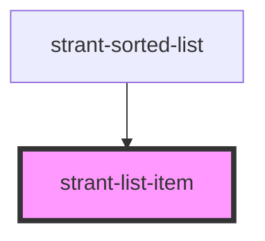

# strant-list-item

<!-- Auto Generated Below -->

## Properties

| Property | Attribute | Description | Type   | Default     |
| -------- | --------- | ----------- | ------ | ----------- |
| `item`   | --        |             | `Item` | `undefined` |

## Events

| Event          | Description | Type                |
| -------------- | ----------- | ------------------- |
| `itemSelected` |             | `CustomEvent<Item>` |

## Dependencies

### Used by

 - [strant-sorted-list](../strant-sorted-list)

### Graph

----------------------------------------------

*Built with [StencilJS](https://stenciljs.com/)*
