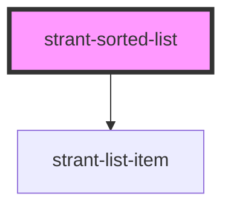

# strant-sorted-list

<!-- Auto Generated Below -->

## Properties

| Property    | Attribute    | Description | Type                    | Default |
| ----------- | ------------ | ----------- | ----------------------- | ------- |
| `orderProp` | `order-prop` |             | `"criticality" \| "id"` | `'id'`  |

## Dependencies

### Depends on

- [strant-list-item](../strant-list-item)

### Graph

----------------------------------------------

*Built with [StencilJS](https://stenciljs.com/)*
